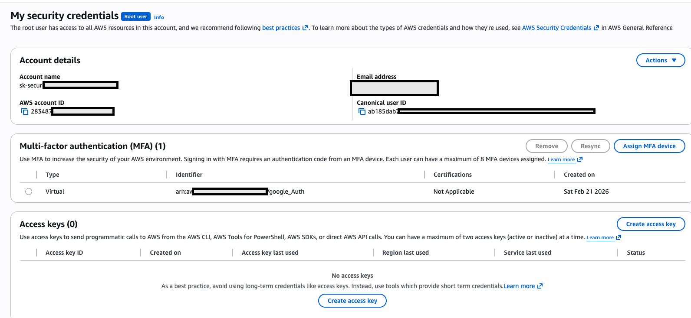
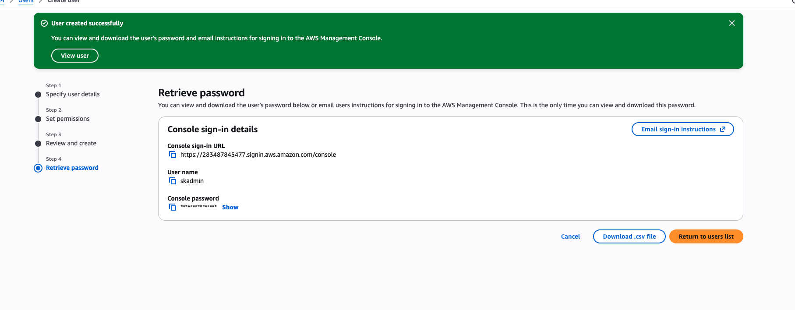
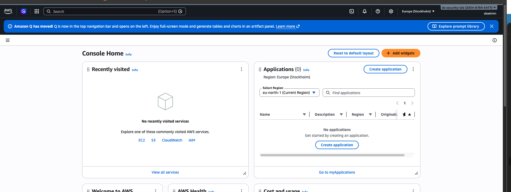

# Task 1: AWS Account Setup & Security Configuration

**Completed:** February 22, 2026  
**Time Taken:** 1.5 hours  
**Status:** ✅ Complete

## Objective

Set up AWS Free Tier account with proper security controls including MFA and IAM user configuration for cloud security lab work.

## What I Built

### 1. AWS Free Tier Account
- **Account ID:** 283487845477
- **Account Name:** sk-security-lab
- **Region:** ap-south-1 (Mumbai)
- **Purpose:** Cloud security hands-on lab environment

### 2. Root Account Security
- ✅ Multi-Factor Authentication (MFA) enabled
- ✅ Strong password configured
- ✅ Backup codes saved securely
- ❌ Root account access restricted (not for daily use)

### 3. IAM Administrative User
- **Username:** skadmin
- **Access Type:** AWS Management Console
- **Permissions:** AdministratorAccess policy
- **MFA:** Enabled (Google Authenticator)
- **Console Sign-in URL:** https://283487845477.signin.aws.amazon.com/console

## Step-by-Step Process

### Phase 1: Account Creation
1. Signed up for AWS Free Tier
2. Verified email address
3. Added payment method (₹2 verification hold, refunded)
4. Completed phone verification
5. Selected Basic Support (Free tier)

### Phase 2: Root Account Security Hardening
1. Enabled MFA on root account using authenticator app
2. Saved backup codes in secure location
3. Documented root account credentials separately

### Phase 3: IAM User Setup
1. Created IAM user: `skadmin`
2. Granted AdministratorAccess permissions
3. Enabled console access with custom password
4. Configured MFA for IAM user
5. Tested login successfully

## Screenshots

### Root Account MFA Configuration

### IAM User Created

### Successful IAM Login

## Security Best Practices Implemented

✅ **Root account MFA** - Prevents unauthorized root access  
✅ **IAM user for daily operations** - Follows least privilege principle  
✅ **MFA on IAM user** - Additional authentication layer  
✅ **Strong passwords** - Complexity requirements met  
✅ **Documented credentials** - Stored securely offline  

## Lessons Learned

### What Went Well
- Account setup was straightforward
- MFA configuration on both root and IAM user successful
- IAM user login worked after troubleshooting

### Challenges Faced
- Initial IAM user login failed - needed to verify exact username format
- Had to ensure using correct IAM sign-in URL (not root URL)

### Key Takeaways
- Always use IAM users, never root account for daily work
- MFA is critical for both root and administrative IAM users
- IAM sign-in URLs are account-specific
- Proper credential management is foundation of cloud security

## Cost Analysis

**Total Cost:** ₹0 (Free Tier)
- AWS Free Tier account: Free
- IAM users: Always free
- MFA: Free (using mobile app)

## Next Steps

- [ ] Set up CloudTrail for security logging (Task 2)
- [ ] Configure GuardDuty for threat detection (Task 3)
- [ ] Create first Python security automation script (Task 4)

## Skills Demonstrated

✅ AWS account management  
✅ Identity and Access Management (IAM)  
✅ Security hardening (MFA)  
✅ Cloud security best practices  
✅ Documentation and process tracking  

---

**Part of:** [SOC to Cloud Security Transformation](../soc-to-cloud-security)  
**Author:** SK Sahabuj Zaman  
**Repository:** [aws-security-lab](https://github.com/sksahabuj/aws-security-lab)
